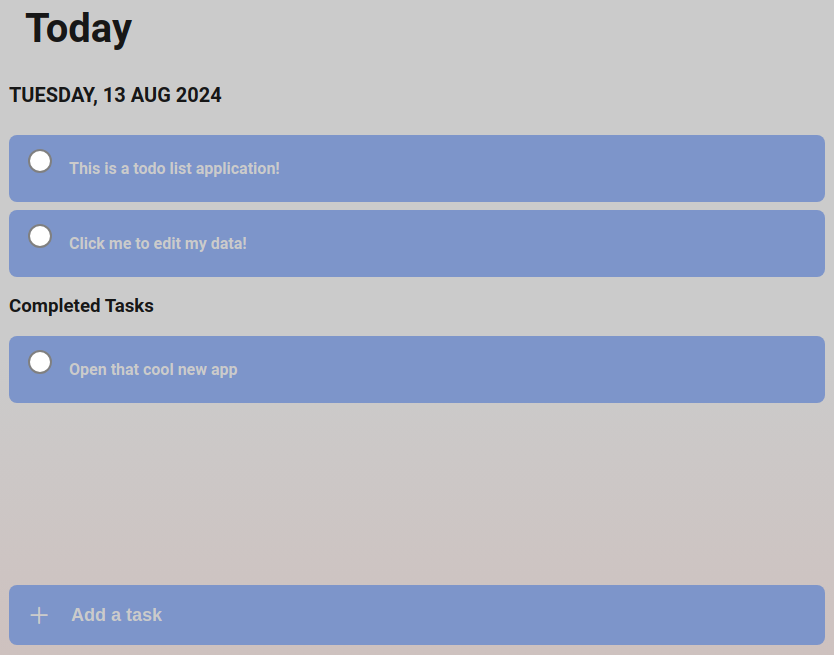

# Todos List (Productify)

## What is Todos List?
Todos List is a task management application designed to help users organize and prioritize their daily tasks. Users can group tasks into projects, assign priorities, and track their progress by marking tasks as completed. The intuitive interface makes it easy to manage even the most complex task lists.

## Why Does Todos List Exist?
Todos List was created as a practical exercise in applying clean architecture principles, as outlined by Uncle Bob in his book *Clean Architecture*. The project serves as a demonstration of how to build maintainable, scalable software with a clear separation of concerns.

## Live Link
Explore the live version of Todos List: [Todos List Live](https://richardanthonysanchez.github.io/odin-todo-list/)

## Onboarding and Expectations
Here are some images to guide you through the onboarding process and give you an idea of what to expect from the app:

- **This is the content section of the homepage. This is where we display all tasks grouped in the current project** 
- **To change the current project, click the hamburger icon on the top left of the page. This is what the [the project manager modal](./img/img-todoslist-projectmanager.png) looks like after clicked** 
- **When you want to modify properties of a task, click on the name of the task in the content section. This will open [the task manager modal](./img/img-todoslist-taskmanager.png) and this area is where you can edit task data** 

## Installation Instructions
If you'd like to install the Todos List project locally, follow these steps:

1. **Clone the Repository:**
   ```bash
   git clone https://github.com/RichardAnthonySanchez/odin-todo-list.git
   ```

2. **Navigate to the Project Directory:**
   ```bash
   cd odin-todo-list
   ```

3. **Install Dependencies:**
   ```bash
   npm install
   ```

4. **Run the Project:**
   ```bash
   npm start
   ```
   Visit `http://localhost:8080` in your browser to access the app.

## Link to The Odin Project Lesson
This project is part of a larger curriculum offered by The Odin Project. You can find the related lesson here: [The Odin Project - JavaScript Todo List](https://www.theodinproject.com/lessons/node-path-javascript-todo-list)
